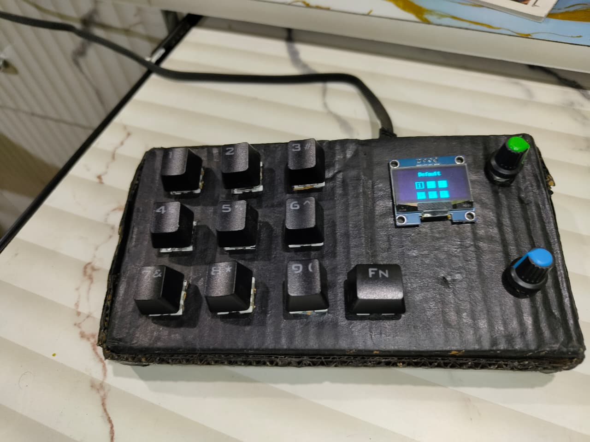
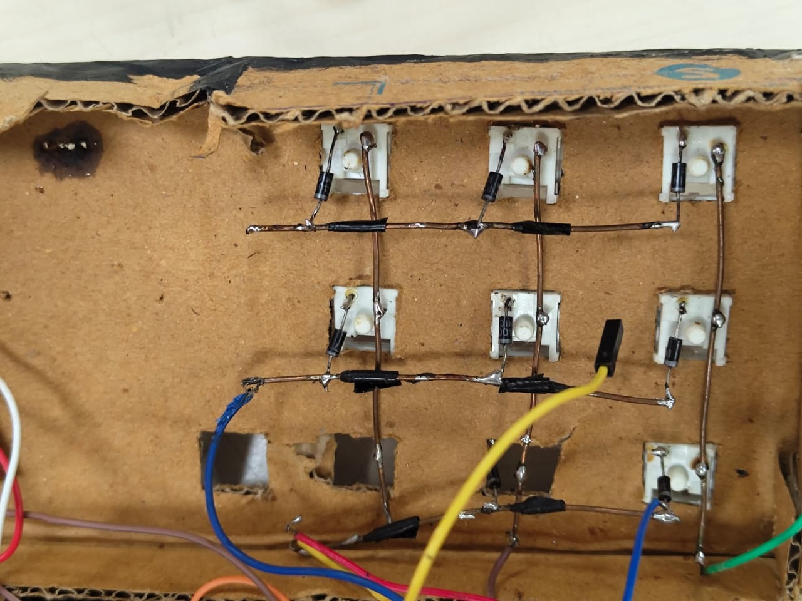
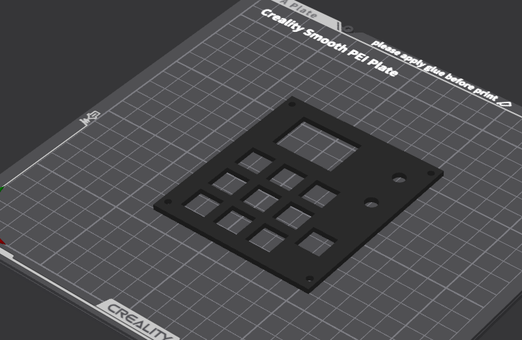
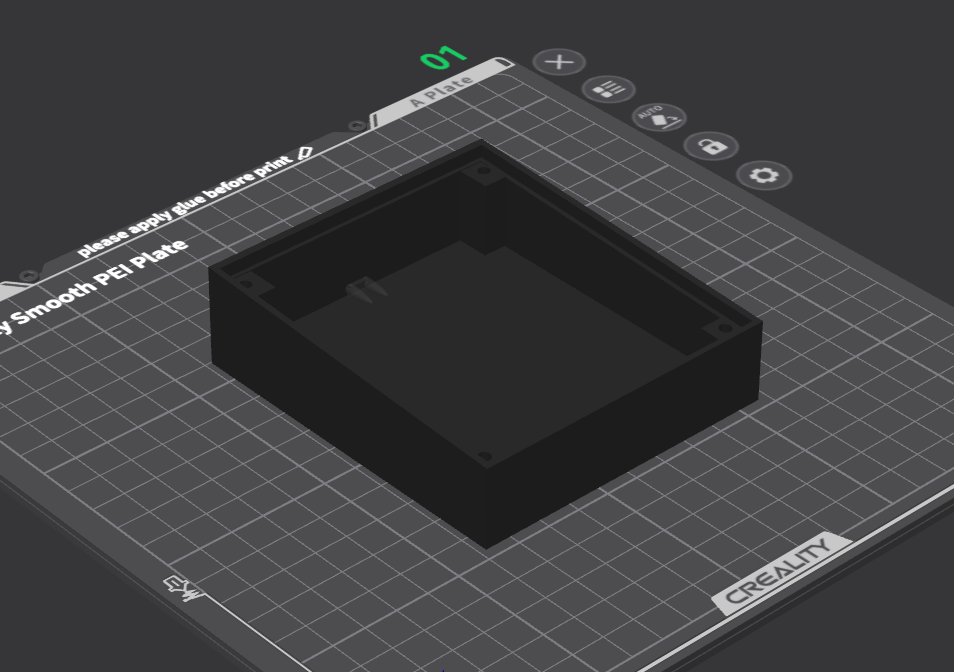

# Macropad 3×3 OLED

A 3×3 mechanical switch macropad with rotary encoders and OLED display, designed with CircuitPython on RP2040. Started as hand-wired prototype, evolving toward custom PCB design.

> **Repository**: https://github.com/harsh-gupta-10/macropad3x3oled

## Overview

This project documents the full design and build process for a compact macropad. Currently running as a functional hand-wired prototype with 9 programmable keys, 2 rotary encoders, and a 1.3" OLED display. The design is being formalized into a custom PCB using KiCAD 8.0 and JLCPCB manufacturing.

**Current status:** Hand-wired prototype complete and working. KiCAD schematic in progress.

## Features

- 3×3 mechanical switch grid (9 keys total)
- 2× EC11 rotary encoders with push buttons
- 1.3" I2C OLED display (SSD1306)
- 6 programmable layers (56 shortcuts total)
- USB Type-C connection
- CircuitPython firmware, fully modular
- Hot-configurable macros (no reflashing needed)

## Hardware Overview

**Current prototype components:**

| Component | Qty | Notes |
|-----------|-----|-------|
| RP2040 microcontroller | 1 | Raspberry Pi Pico or compatible |
| Mechanical switches (MX) | 9 | User choice; same profile |
| EC11 rotary encoders | 2 | With integrated push switch |
| SSD1306 OLED display | 1 | 1.3" I2C interface |
| 1N4148 diodes | ~10 | Anti-ghosting matrix diodes |
| USB Type-C breakout | 1 | For power and data |
| Hook-up wire (22 AWG) | — | Solid core preferred |

**Key design notes:**
- Matrix scanning: 3 rows + 3 columns = 9 keys with just 6 GPIO pins
- I2C protocol: 2 wires (SDA, SCL) with 4.7kΩ pull-up resistors
- Power: 5V USB → 3.3V logic via linear regulator
- Debouncing: Software-based (20ms typical)

---

## Firmware Overview

Using CircuitPython on RP2040 for firmware. Clean Python implementation without build systems.

**Core functionality:**
- Matrix scanning: Reads 3×3 switch array, debounces input
- Encoder handling: Gray code decoding for 2 rotary encoders
- I2C display: Layer indicator and status on OLED
- USB HID: Presents as standard keyboard to operating system

**Firmware features:**
- 6 programmable layers for macro storage
- Real-time layer switching via encoder
- Per-key configurable actions
- Modular design (RGB, wireless support can be added)
- Configuration stored in `config.py`

## Usage / Workflow

**Basic operation:**
1. Connect via USB → device appears as keyboard
2. Press keys to trigger mapped macros/commands
3. Rotate encoders to switch layers or control functions
4. OLED shows current active layer

**Configuration:**
- Edit `config.py` in CircuitPython file system
- Reload to apply changes
- No firmware reflash needed

**Workflow example:**
- Layer 1: Productivity shortcuts (Alt+Tab, Copy/Paste, etc.)
- Layer 2: Media controls (Play, Volume, Next)
- Layer 3: Application launcher shortcuts
- Switch layers by rotating encoder

---

## Design & Build

### Hand-Wired Prototype Status

Current build is fully functional hand-wired setup. Validates all design decisions before PCB manufacturing.

**Current state:**
 

### PCB / Schematic Design

Formalizing the design in KiCAD 8.0 for manufacturing through JLCPCB.

**Schematic phase:**
- Component selection and library setup
- Connection documentation (nets)
- Electrical rule checking (ERC)
- Footprint assignment

**Layout phase:**
- 2-layer PCB design (top: signals, bottom: ground plane)
- Design rules: 0.25mm trace width, 0.2mm clearance
- Dense ground via placement
- Manufacturing constraints (1mm board edge minimum)

**Signal integrity considerations:**
- I2C traces (SDA/SCL) routed together
- USB traces kept short and clean
- Test points for hardware debugging
- Decoupling capacitors near all power pins

**Manufacturing:**
- Gerber file generation from KiCAD
- Pre-order verification using Gerber viewers
- JLCPCB ordering: $5-20 for 5 prototype boards
- Expected turnaround: 7-10 days

### CAD / Design Files

The hardware case and enclosure are under development:
- Base design: `cad/macropad base v0.f3d` (Fusion 360)
- Top design: `cad/macro pad v3 top final.f3d` (Fusion 360)
- 3D printable base: `production/macropad base stl.3mf`

Files are in the `cad/` and `production/` directories. 3D printing materials: PLA or PETG recommended.

---

## BOM (Bill of Materials)

**Prototype assembly cost: $50-65 usd i got pricing from amazon.com(But in india i got all this under 25 usd)**

| Item | Qty | Unit Cost | Total | Source |
|------|-----|-----------|-------|--------|
| Mechanical switches (MX) | 9 | $1 | $9 | Outemu switches 2 pins |
| Keycaps (1u profile) | 1 set | $10-30 | $20 | Matched to switch type |
| EC11 rotary encoders | 2 | $3 | $6 | With push switch |
| SSD1306 OLED 1.3" display | 1 | $5 | $5 | I2C interface |
| RP2040 microcontroller | 1 | $5 | $5 | Raspberry Pi Pico |
| USB Type-C breakout board | 1 | $3 | $3 | For future PCB |
| 1N4148 signal diodes | 10 | $0.20 | $2 | Anti-ghosting matrix |
| Hook-up wire (22 AWG) | 1 spool | $5 | $5 | Solid core |
| USB cable | 1 | $3 | $3 | Programming/power |
| 3D printer filament | 50-100g | $0.02/g | $1-3 | PLA or PETG |
| **Total** | — | — | **$50-65** | — |

**PCB manufacturing (future):**
- Board fabrication: $5-20 for 5 boards via JLCPCB
- Component cost per unit: $30-40 
- Full assembled board cost (future): $50-60 per unit

---

## Future Improvements

- **4-layer PCB** — Better power distribution, reduced EMI
- **RGB LED matrix** — WS2812B per-key addressable LEDs
- **Metal enclosure** — CNC-milled aluminum case
- **Wireless support** — RP2040-W variant with Bluetooth
- **Battery charging** — LiPo connector with charge IC
- **Potentiometer option** — Analog knob instead of encoder
- **Configuration UI** — Desktop app for macro programming
- **Backlight** — Per-key or underglow LED strips

---

## Images / Gallery

**Current prototype build:**
- Top view: 
- Internal view: 
- Reference photos:  

---

## Repo / Links

- **GitHub Repository**: https://github.com/harsh-gupta-10/macropad3x3oled
- **Raspberry Pi Pico Documentation**: https://www.raspberrypi.org/documentation/microcontrollers/raspberry-pi-pico.html
- **CircuitPython**: https://circuitpython.org/
- **KiCAD**: https://www.kicad.org/
- **JLCPCB**: https://jlcpcb.com/

---

##  Acknowledgements

Resources used:
- Raspberry Pi Foundation (RP2040 documentation)
- Circuit Python community
- KiCAD open-source PCB design tools

---

## License

MIT License - Feel free to use this design for your own projects.

See LICENSE file for details.

- Check diode orientation (trust me, you'll get this wrong)
- Test one key in isolation with a multimeter
- Verify GPIO pins match what the code expects
- That loose wire you "fixed" earlier? Check it again

### OLED display shows nothing

**Panic level:** Moderate

- I2C address mismatch? Run the I2C scanner code
- Pull-up resistors missing? Add 4.7kΩ on SDA and SCL
- Wrong I2C pins? Check code vs wiring
- Display DOA? Try another one (happened to me)

### Encoder spinning but not detecting

This one is fun:

- Gray code logic wrong? Complex but traceable
- Debounce timing too aggressive? Try different values
- Continuity bad? Test each pin with multimeter
- Encoder defect? Swap it out and test

### PCB doesn't work after assembly

**This is the fun one:**

- Cold solder joints? Use more flux and reheat
- Continuity bad? Multimeter everything
- Component orientation wrong? Some parts care deeply (ICs)
- Wrong component values? Double-check BOM vs assembled board
- Power OK but nothing works? Ground plane problem (probably)

### General debugging philosophy

1. Power first — Is there actually voltage where there should be?
2. Ground second — Is ground actually connected?
3. Logic third — Are signals even reaching their destinations?
4. Code last — Because 99% of the time it's hardware

Also, take a break before debugging. Frustrated you makes worse decisions.

---

## Contributing

I'd actually love feedback, suggestions, or just hearing about your own PCB adventures.

**Issues/PRs welcome for:**
- Design improvements (better component placement, better routing)
- Firmware enhancements
- Documentation clarifications
- "Hey I did this too" stories
- Cheaper alternative components
- Anything I'm doing wrong (seriously though)

---

## License

This project is open source. See the repository for details.

---

**Built by [Harsh Gupta](https://github.com/harsh-gupta-10)** ⌨️

If you're thinking about learning PCB design: start with something you actually want to use. Make it work first with whatever you have. Then make it pretty. The learning comes from the iteration, not the destination.
